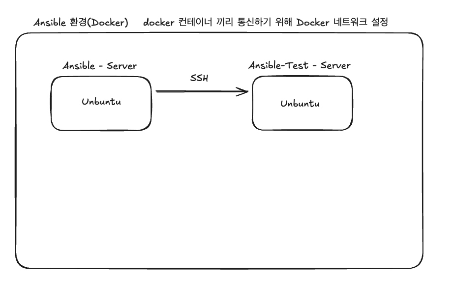
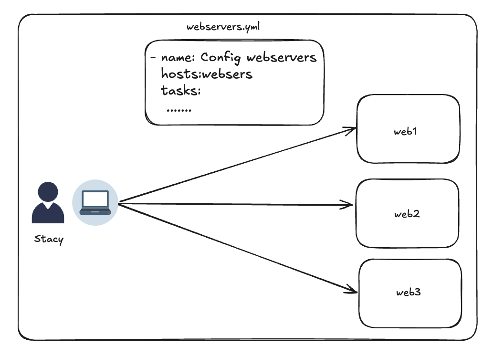

## 1장. 앤서블 설치 및 동작 방식(MAC OS)

---

### 설치 버전 정보
- 파이썬(python): 3.10.15 버전
- 앤서블(Ansible): 2.17.4 버전
- Jinja2(Ansible의 템플릿 엔진): Ansible 설치 시 자동으로 다운됨

**(Mac OS)homebrew로 설치하기**


``` bash
#homebre 설치 확인
brew --version

#python 설치 및 확인
brew install python@3.10
python3.10 --version

#가상 환경 사용 활성화
# 다른 프로젝트와 충돌을 막기 위해 가상 환경을 설정함
# 가상환경 생성 및 활성화
python3 -m venv ansible-env
source ansible-env/bin/activate

#Ansible, Jinja2 설치 및 확인
pip install ansible
ansible --version
```

<br/>

**(docker) 컨테이너로 설치하기**



Docker 네트워크 설정하기
- docker 컨테이너 간의 통신을 위해 사용자 정의 네트워크를 생성함
``` bash
docker network create ansible-net 
```

``` bash
#ansible-server 설치하기 및 앤서블 설정 파일을 작성 후 마운트하여 컨테이너 생성하기
docker run -it --name ansible-server --network ansible-net -v 작성파일 절대경로 playbooks:/playbooks ubuntu

#docker 컨테이너
#python3및 ansible 설치
apt-get update
apt-get install -y python3 python3-pip

apt-get install -y ansible
```

<br/>

### 앤서블의 사용 용도
- 인프라에서 자원(서버, 스토리지,  네트워크 등)을 준비하고 설정하는 과정을 의미함

사용 용도
1. 프로비저닝: 새로운 서버나 클라우드 인스턴스를 생성하고 초기 설정을 자동으로 수행함
   - AWS, Azure와 같은 클라우드 서비스에서 인스턴스를 생성하고 필요한 소프트웨어를 설치하는 작업을 자동화함

2. 구성관리: 서버의 소프트웨어와 설정을 일관되게 유지하고 관리함
   - 패키지 설치, 서비스 설정, 파일 배포 등을 포함함

3. 어플리케이션 배포: 어플리케이션을 여러 서버에 배포하고 구성하는 작업을 자동화함
   - 개발, 테스트, 프로덕션에 맞게 어플리케이션을 배포하는데 유용함

4. 오케스트레이션: 여러 개의 서버와 서비스를 조정하여 복잡한 환경을 관리함
   - DB 서버와 웹 서버간의 상호 작용을 조정할 수 있음

5. 다양한 시스템과의 통합
   - Ansible은 다양한 운영체제와 클라우드 서비스와 통합되어 유연한 관리가 가능함

<br/>

#### 장점
1. 읽기 쉬운 문법
- 앤서블 설정 관리 스크립트를 **"플레이북"** 이라고 함
- 앤서블의 플레이북 문법은 YAML 기반으로 만들어져 있어 사용자가 비교적 읽기 쉬운 문법으로 구성되어 잇음

2. 원격 호스트에 설치하지 않아도 됨
- 2.4버전 이상의 앤서블로 서버를 관리하려면 서버에 SSH와 파이썬 2.6이상 또는 파이썬 3.5버전 이상이 설치되어 있어야 함

3. 푸시 기반
- 서버에 변경 사항이 언제 발생하는지 기다릴 필요 없이, push 방식으로 수 많은 서버를 바로 바로 확장 가능함

4. 앤서블의  규모 확장 기능
- 앤서블은 단일 서버뿐만 아니라, 수천 대의 노드를 관리하는데 사용함

5. 내장 모듈
- 앤서블은 여러 모듈을 사용하여 패키지 설치, 서비스 재시작, 설정 파일 복사와 같은 작업을 수행함
- 앤서블 모듈은 선언적이며, 서버의 변경되어야 할 상태를 설명하기 위해 앤서블 모듈을 사용함
- 모든 모듈은 **멱등성**을 가짐

-> 앤서블 플레이블을 서버에서 여러 번 실행해도 안전함

6. 매우 얇은 추상화 레이어
- 앤서블은 다른 자동화 도구와 비교했을 때, 사용자가 시스템을 관리할 때 필요한 추상화가 최소화되어 있음

<br/>

#### 프로비저닝
- IT인프라에서 자원을준비하고 설정하는 과정을 의미함

주요 작업
1. 자원 생성: 서버나 클라우드 인스턴스를 생성함
2. 소프트웨어 설치: 필요한 운영체제나 어플리케이션 소프트웨어를 설치함
3. 네트워크 설정: IP주소, 방화벽 규칙 등을 설정하여 네트워크 연결을 구성함
4. 환경 설정: 시스템의 기본 설정을 조정하여 필요한 환경을 구성함

<br/>

### 앤서블의 동작 방식
예시) sticky라는 사용자가 nginx를 실행하기 위해 3개의 우분투 기반 웹 서버를 설정하기 위해 앤서블을 사용함
- webservers.yml이라는 앤서블 스크립트 작성함

**플레이북**
- 앤서블에서의 스크립트
- 플레이북은 설정할 호스트(host)와 해당 호스트에서 수행할 테스트의 정렬된 리스트를 설명함


| 호스트  | 테스크                    |
|------|------------------------|
| web1 | 엔진엑스 설치                |
| web2 | nginx 설정 파일 생성,보안 인증서 복사 |
| web3 | 엔진엑스 서비스 시작            |

**플레이북 실행**

`ansible-playbook` 명령어를 통해 플레이북을 실행함
- 예시) 플레이북 명: webservers.yml

``` bash
ansible-playbook webservers.yml
```

web1,web2,web3을 병렬로 SSH 연결
- 3대의 모든 호스트에서 동시에 리스트의 첫번째 테스크가 실행됨
``` bash
- name: Install nginx
  apt: name=nginx
```

**앤서블의 작업**

1. 엔진엑스의 패키지를 설치하는 파이썬 스크립트를 생성함
2. 스크립트를 web1,web2,web3에 복사함
3. 모든 호스트에서 스크립트의 실행이 완료될까지 기다림
4. 모든 호스트에서 스크립트의 실행이 완료될 때까지 기다림

### 정리
- 총 4가지 부분 중 다음 부분이 중요함
1. 앤서블의 모든 호스트에서 병렬로 각 테스크를 실행함
2. 앤서블은 모든 호스트가 태스크를 완료할 때까지 기다렸다가 다음 태스크로 이동함
3. 앤서블은 지정한 순서대로 태스크를 실행함




<br/>


### 테스트 서버 설정
- Docker 네트워크 생성(도커 컨테이너에서 생성 때 먼저 생성함)
- Ansible 테스트 컨테이너 생성

``` bash
docker run -it --name ansible-test-server --network ansible-net ubuntu
```


1. 테스트 서버 설정
- 접속 후 테스트 서버 설정
``` bash 
#python3및 ansible 설치
apt-get update
apt-get install -y python3 python3-pip

apt-get install -y ansible
```

2. ssh 설치 및 시작
``` bash
apt-get install -y openssh-server
service ssh start 
```

3. ssh 사용자 생성
- ssh 접속을 위한 사용자를 생성하고 비밀번호 설정
``` bash
useradd -m ansible_user
echo "ansible_user:패스워드" | chpasswd
```

5. 인벤토리 파일 설정
- playbook/hosts 파일 설정
- 앤서블은 명시적으로 알고 있는 서버만 관리할 수 있음
- 인벤토리 파일(inventory file)에 서버 리스트를 설정함으로 앤서블에 서버 정보를 제공함
- (도커 작성 후 Ansible 컨테이너의 host파일 등을 수정하여 재빌드)

``` text
[ansible-test]
#ansible-test-server ansible_host=<컨테이너_IP> ansible_user=<사용자명>
ansible-test-server ansible_host=ansible-test-server ansible_user=ansible_user
```

6. ansible.cfg 파일 설정
- ansible의 설정 파일인 ansible.cfg를 생성하여 기본값을 지정함
- `inventory`: Ansible이 사용할 인벤토리 파일의 경로를 지정함
- `host_key_checking` : SSH 호스트 키 확인을 비활성화하여 연결 시 불필요한 확인을 생략함
``` text
[defaults]
inventory = playbooks/hosts
host_key_checking = False
```

7. ping 테스트

로컬 ping 테스트
- Ansible - server에서 이 테스트 컨테이너에 연결할 수 있는지 확인함

``` bash
 ansible localhost -m ping
```

- Ansible-server에서 Ansible-test-server가 연결될 수 있는지 확인함

``` bash
#Ansible-test-server가 정상적으로 ssh로 연결가능한지 확인
ssh ansible_user@ansible-test-server

#Ansible-test-server에 접속하기 위한 public/private 키 발급
ssh-keygen -t rsa

#발급받은 ssh키를 Ansible-Test-Server에 등록
ssh-copy-id ansibleuser@ansible-test server

#정상적으로 Ansible-Test-Server에 등록되었는지 ssh로 다시 접속
ssh ansible_user@ansible-test-server
```

8. 마운트되어 이미지 빌드된 ansible.cfg 파일 수정

``` bash
cd playbooks/
[defaults]
inventory = /playbooks/hosts
host_key_checking = False
```

9. ssh로 접속
- ansible.cfg 및 hosts 파일이 있는 경로에서 ping을 날려야 함
``` bash
 ansible ansible-test-server -m ping
```
